# Звіт з налаштування Jenkins CI/CD

## Етап 1: Розгортання Jenkins та створення найпростішої збірки
Починаємо з розгортання Jenkins та створення найпростішої збірки для перевірки працездатності інфраструктури.

**Встановлений Jenkins** 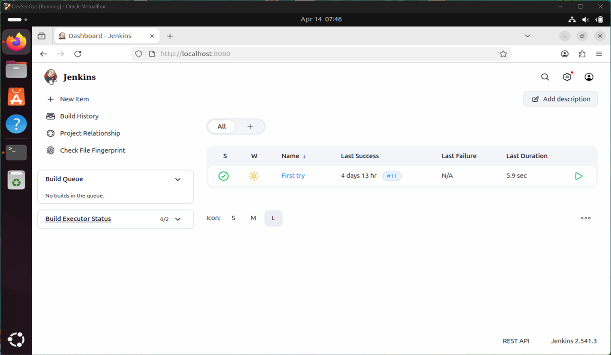

**Підключення через SSH (Копіювання публічного ключа на цільовий сервер)** 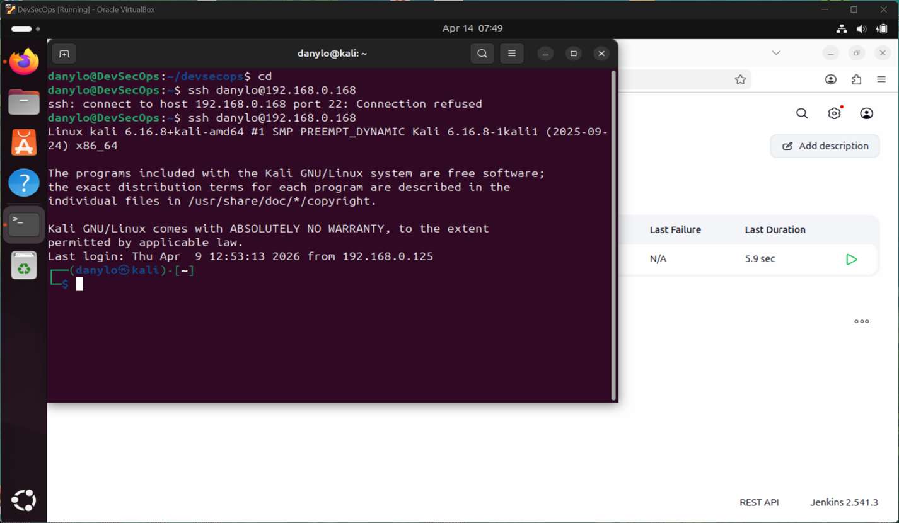

**Налаштування базового білду (виконання тестової команди)** 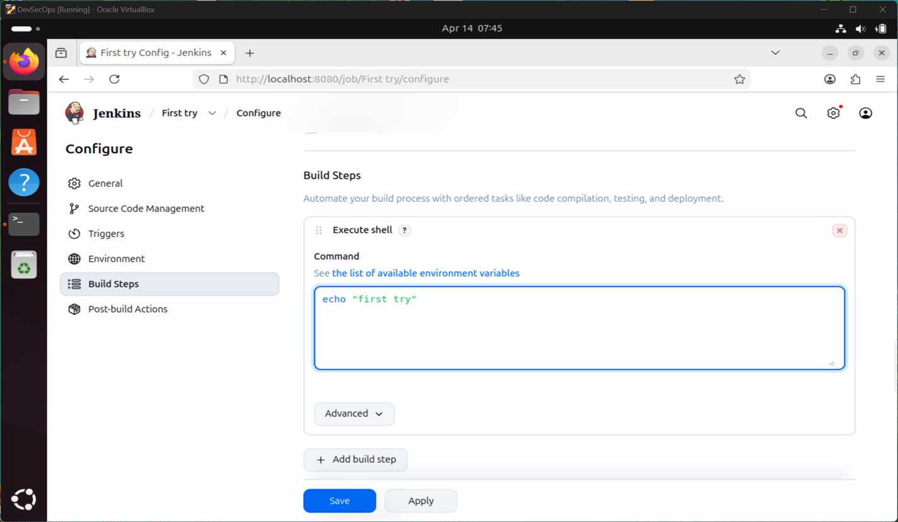

---

## Етап 2: Підготовка до деплою по SSH
Щоб Jenkins міг відправляти файли на наш веб-сервер, встановлюємо необхідний плагін та налаштовуємо права доступу на цільовій машині.

**Встановлення плагіну Publish Over SSH** 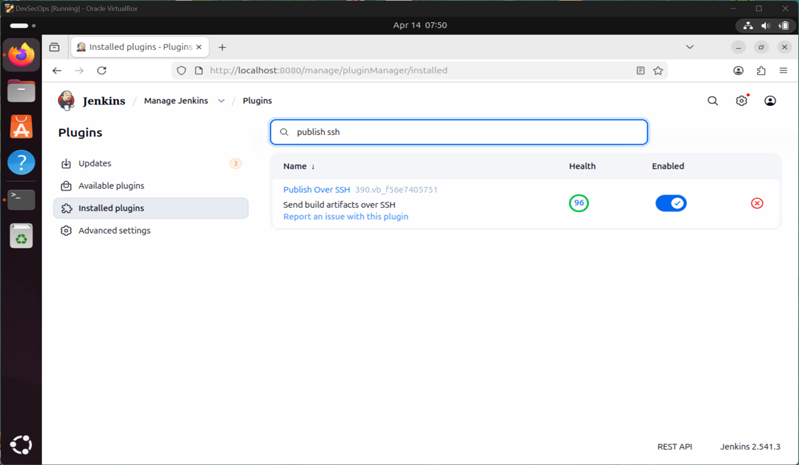

**Налаштування параметрів цільового SSH-сервера у глобальній конфігурації Jenkins** 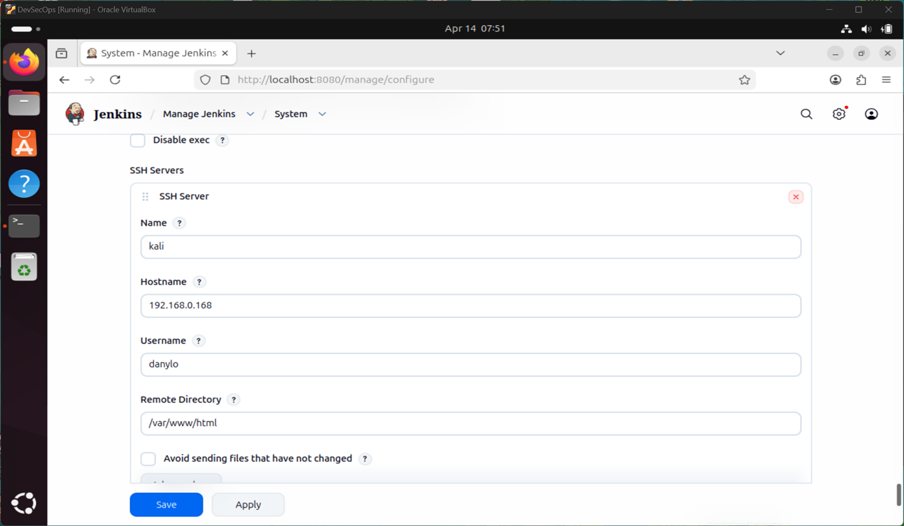

**Налаштування прав доступу (chgrp, chmod) до папки /var/www на цільовому сервері** 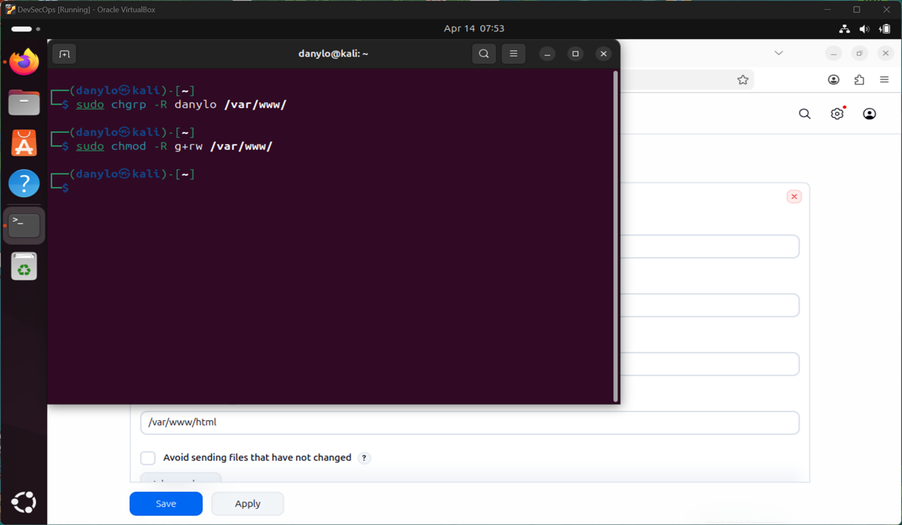

---

## Етап 3: Налаштування та перевірка деплою
Додаємо крок передачі файлів у нашу джобу. Jenkins відправлятиме зібраний index.html безпосередньо на веб-сервер.

**Додавання кроку Send files or execute commands over SSH у налаштуваннях джоби** 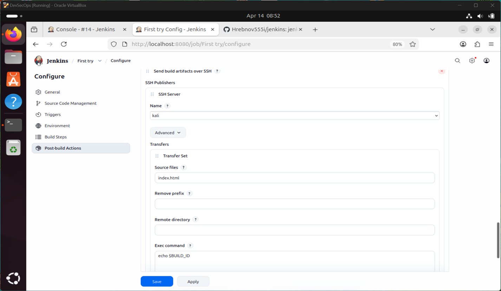

**Успішний деплой: веб-сторінка завантажилась у браузері** *(Тут можна додати скріншот браузера, якщо є)*

---

## Етап 4: Інтеграція з системою контролю версій (GitHub)
Наступний крок еволюції CI/CD — Jenkins повинен автоматично підтягувати актуальний код з Git-репозиторію перед тим, як його деплоїти.

**Додавання Deploy Key у налаштуваннях репозиторію GitHub** 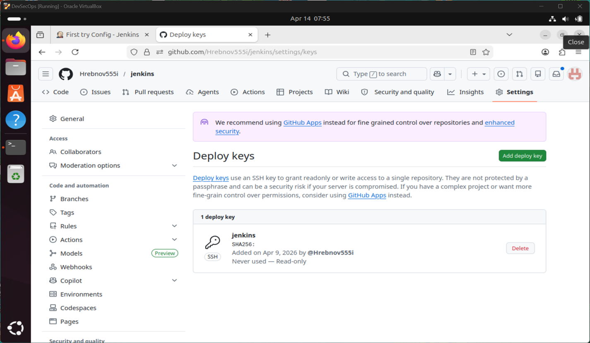

**Налаштування Credentials для підключення до репозиторію по SSH** 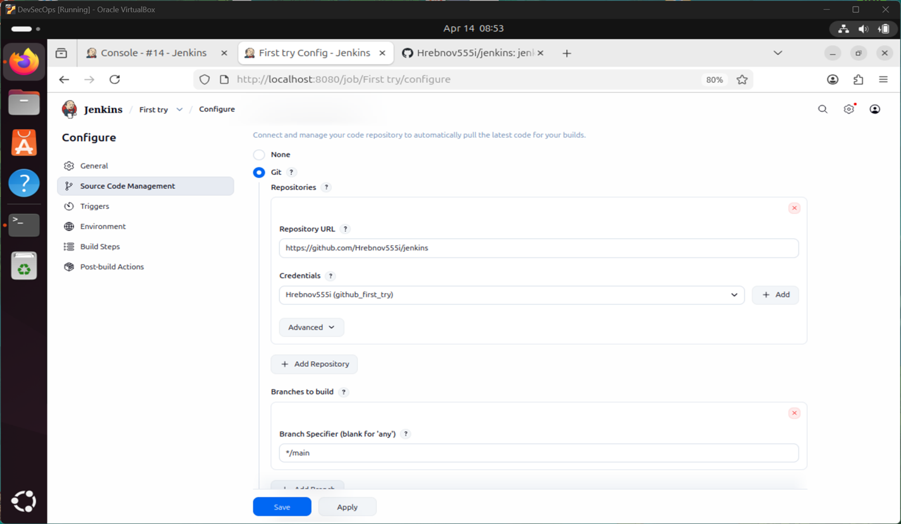

**Вказування Repository URL та інтеграція Git із кроком деплою** 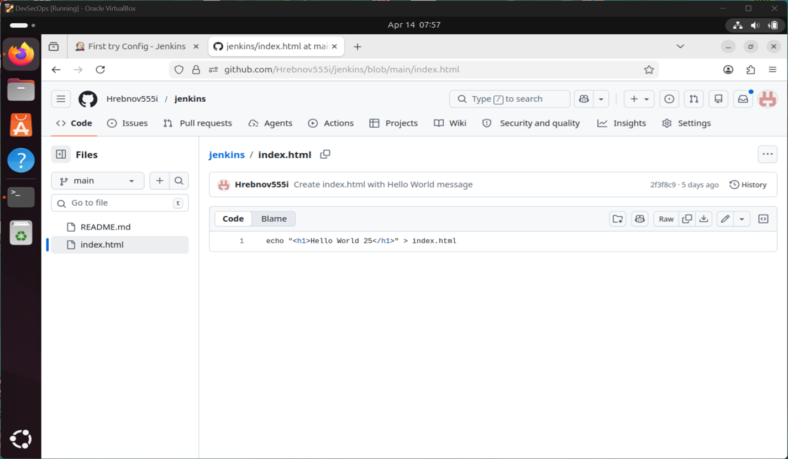

**Консольний вивід: успішне клонування репозиторію та відправка файлів по SSH** 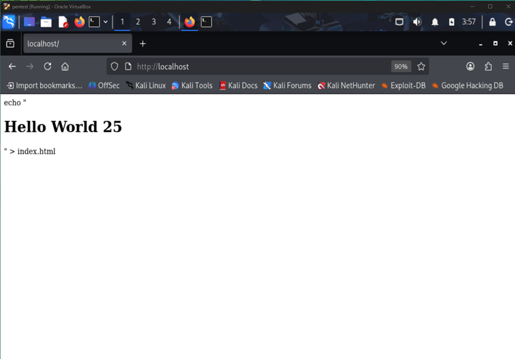

**Створення нового проекту формату Pipeline** 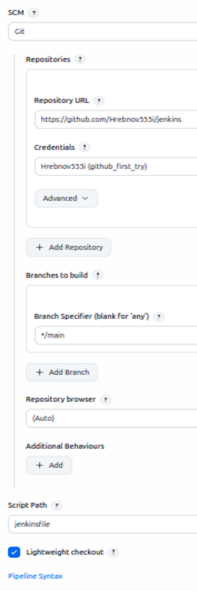

**Написання декларативного Pipeline скрипта з розбивкою на етапи (Stages) та запуск задачі** 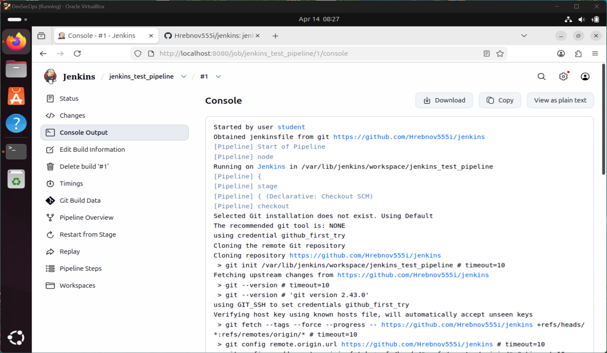
